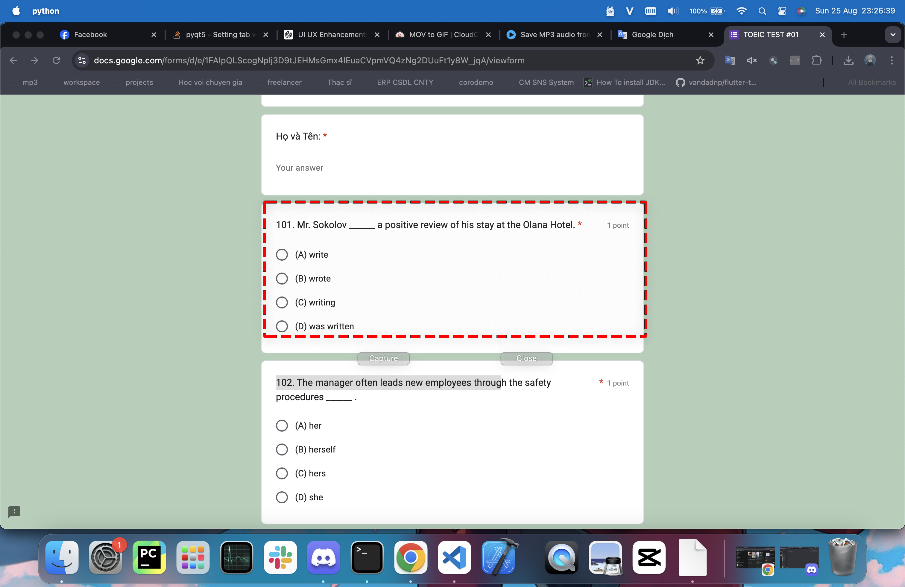

# Fast Screenshot AI

Fast Screenshot AI is a sleek and intuitive desktop application designed to help you quickly capture, extract text, and interact with GPT-3. Whether you need to grab text from an image, summarize content, or ask AI for insights, Fast Screenshot AI offers a seamless workflow.

## Key Features

- **Screen Area Selection:** Effortlessly select any portion of your screen and instantly display the captured area within the app.
- **OCR Text Extraction:** Extract text from the captured area using built-in Optical Character Recognition (OCR) powered by Tesseract.
- **AI Integration with LLM :** Easily query LLM (GPT-4o or Ollama) with extracted text for smart responses, content summarization, or further analysis.
- **User-Friendly UI/UX:** Enjoy a polished, complete with smooth animations, responsive layouts, and a clutter-free experience.
- **Integrated Workflow:** Capture, edit, and interact with text in a streamlined process that maximizes productivity.

## Why Fast Screenshot AI?

Fast Screenshot AI is designed for anyone who needs a quick and reliable way to capture text from their screen and leverage AI to enhance their productivity. The app’s intuitive design and intelligent functionality make it the perfect tool for professionals, researchers, students, and creatives alike.

## How to Use

1. **Select Area:** Click the "Select Area" button to capture any part of your screen. The selected area will be displayed within the app.
2. **Extract Text:** After selecting the area, click "Extract Text" to process the image using OCR and extract the text for editing.
3. **Ask LLM:** Use the "Ask" button to send the extracted or edited text to GPT-4 for AI-powered responses or summaries.

## Demo

### Screenshots

| Feature              | Screenshot |
|----------------------|------------|
| Screen Area Selection|  |
| View Screenshot      |  |
| Text Extraction      |  |
| GPT-4 Interaction    |  |

### Video

You can watch the demo video [here](https://www.youtube.com/watch?v=UEyTqVNx0oE).

## Package Manager

We use Poetry as the package manager. Therefore, **do not use the pip command to add packages**. The only exception is using pip to install Poetry itself.

Here are some Poetry commands you might find useful:

```bash
# Install the packages listed in pyproject.toml
poetry install

# Use the virtual environment created by Poetry
poetry shell

# Add a package to pyproject.toml and the virtual environment
poetry add <package_name>

# Add a development dependency
poetry add -G dev <package_name>

# Remove a package
poetry remove <package_name>

# Update a package (if not specified, updates all packages)
poetry update <package_name>

# Run a command within the virtual environment without entering it
poetry run <command>
```

## Contributing

Contributions are welcome! Feel free to submit a pull request or open an issue for any bugs, features, or improvements.

## License

This project is licensed under the MIT License. See the [LICENSE](LICENSE) file for details.
